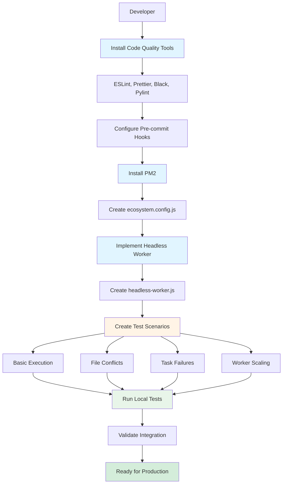
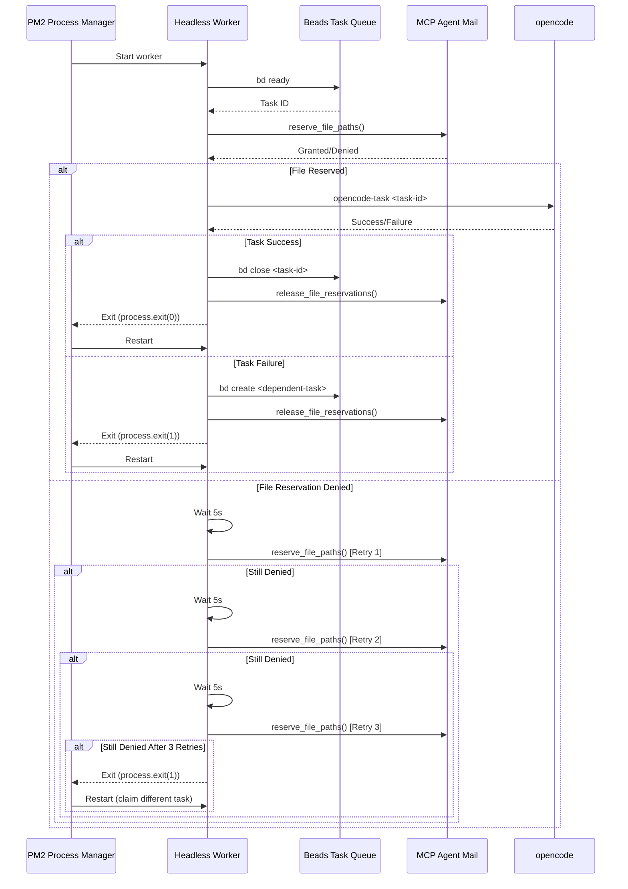
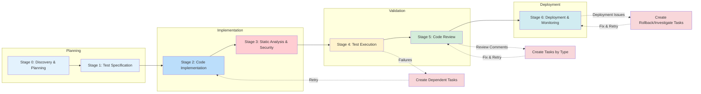
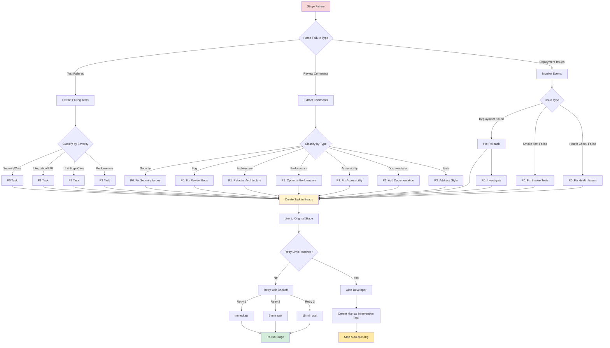
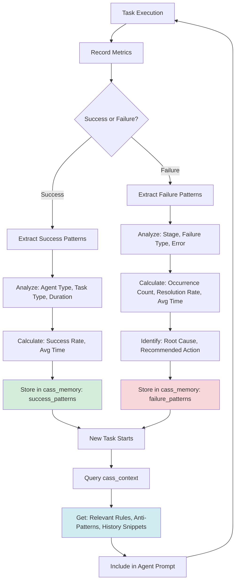
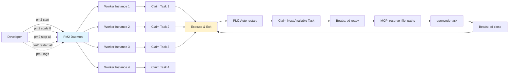
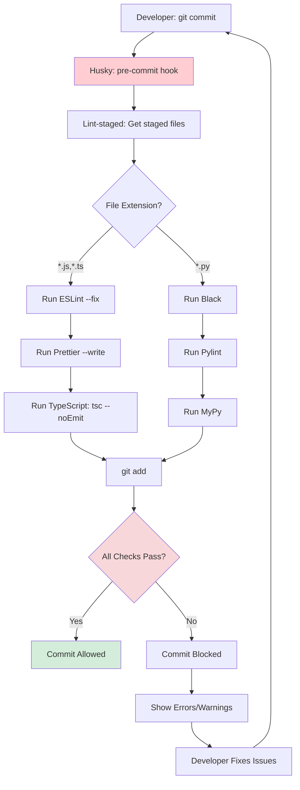
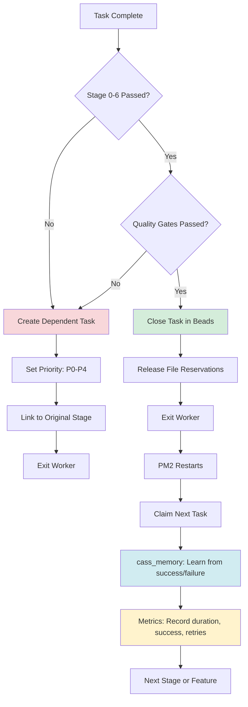
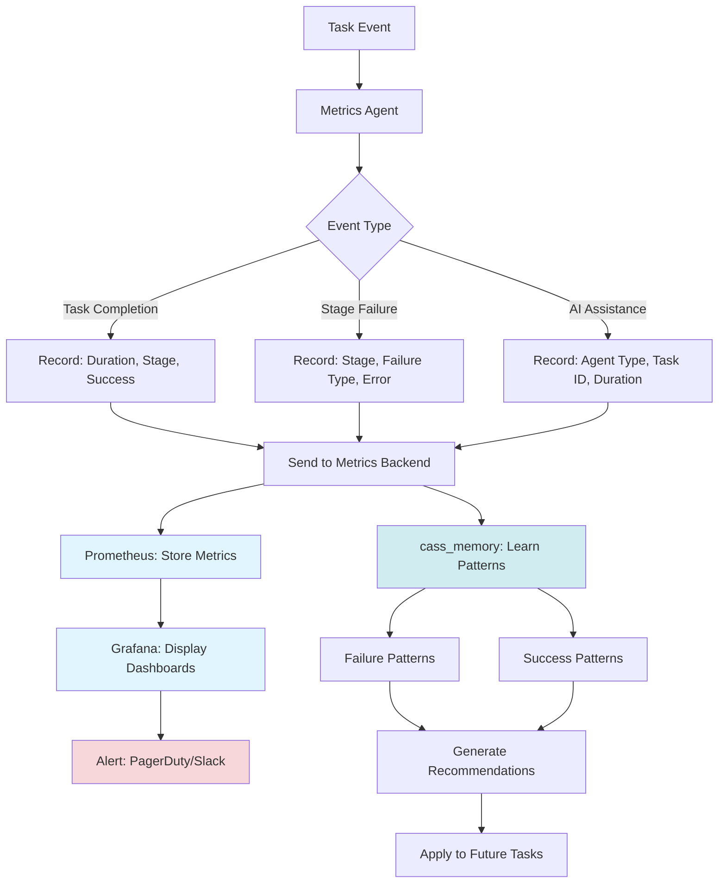

# Task Implementation Process - Visual Guide

## Local Development Process (Phase 1)

## Headless Worker Execution Flow

## 6-Stage Iterative Workflow

## Failure Handling & Task Creation

## Cass Memory Learning Loop

## PM2 Worker Management

## Pre-commit Hook Flow

## Success Criteria Flow

## Local to Production Rollout

```mermaid
graph LR
    subgraph Phase 1: Local Development
        A1[Install Code Quality Tools]
        A1 --> A2[Install PM2]
        A2 --> A3[Implement Worker]
        A3 --> A4[Test Locally]
    end
    
    subgraph Phase 2: Staging
        B1[Deploy to Test Environment]
        B1 --> B2[Run Integration Tests]
        B2 --> B3[Validate with Multiple Workers]
    end
    
    subgraph Phase 3: Production
        C1[Deploy PM2 Config]
        C1 --> C2[Start Worker Pool]
        C2 --> C3[Monitor Performance]
        C3 --> C4[Scale as Needed]
    end
    
    A4 --> B1
    B3 --> C1
    
    style A4 fill:#d4edda
    style B3 fill:#fff3cd
    style C4 fill:#e1f5ff
```

## Metrics Collection Flow

